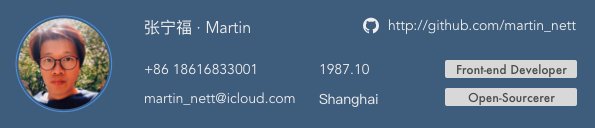

# Work Experiences
#### 2017 - Now丨DiningCity · Senior Front-end Developer
The reason why I chose a position of front-end developer is  I’ve been a product manager for 4 years, I still have great enthusiasm for the product implementation.  

I have tried many new technologies and methods in the last two years. I have mastered the development of WeChat Mini Program, mastered many JavaScript frameworks, understood the correct method of front-end componentization, and started to write open source projects.  

As the only front-end developer in this company, I’ve completed several front-end products excellently.  

#### 2016 - 2017丨CNCrowd · Product Manager
My graduate tutor and his partner set up a startup to do internet crowdfunding, I was persuaded to give up the work of SMW and was appointed as the product manager and technical partner of the company.

#### 2013 - 2016丨SMW · Product Manager
Just as I was leaving my job, one of my clients wanted me to work for his company as a product manager and I became one of the co-partners in that company. That company was committed to providing digital media and advertising services to the medical industry.  

In 3 years, I have done more than a dozen products in that company, and the high-intensity work has greatly improved my ability of product management and project management.  

#### 2010 - 2013丨KYEE · Product R&D
I worked in KYEE for about 3 years, main charge is product resourch & develop. All product is based on C# making mobile healthcare system. I also do some implement job at that time. About 10 hospitals systems had been passed and accepted include PDA, electric card for patients etc.  

Although it was a very painful 996 experience, I did lay a solid foundation for my career during that time.  

# Projects & Works
#### DC Assistant · Ionic 4 app (iOS & Android)
Due to the constant upgrading of Angular, the **Ionic framework** has been updated, and the latest version has reached 4. I quickly taught myself the new framework and made our new app DC Assistant which helps restaurants manage their reservations easier.

#### OpenSource · GitLab Go
Since I’ve mastered wechat mini program and we use **GitLab** to be our project management system, then I decide to make a GitLab client to make work easier. I used my development experience to make the functions of mini programs more stable, while the code is less. I opened-source my code and gave lectures in the hope of helping more people who love developing small programs to find development skills asap.

#### DiningCity · Wechat mini program
I taught myself the WeChat mini program at the end of 2017 and quickly mastered the development method. Unexpectedly, two months later, the company’s weekly meeting decided to do the **WeChat mini program**, I quickly completed the development.

#### Healthcare Service · Hybird App
The healthcare service is an App for our healthcare area customer internal use. The main functions of the App is help them to collecting data, reserve service, register customer and statics etc. Considering the time & cost, we decide to use **hybird** way to build the App. the front-end use **Angular** and the back-end provide APIs by rails. Database use **MySQL & CouchDB**. I also learned Best Practice of Angular from Johnpapa.

#### OpenSource · RubyChina App
I took part in **RubyConf** 2015 in Shenzhen. The speaker suggested that our community need a App for smart phones in the morning. I try to start make a demo in the afternoon. I finished demo using **Ionic framework** during the whole night. When I showed it to that speaker at the next day. He was very interested in it and he hope that I can move on. After that, in the coming next 2 months we talked & improved it together on **GitHub**. Finally, it was launched in 2016.2.

#### Web crawlers · Python
I like to analyze data, so I taught myself **python** and **web crawlers**. I fetched many popular websites and have databases of these big websites.

# Education Background
#### 2013 - 2017丨SJTU · Master Degree · Software Engineering (Dropped out)
In 2013, I was admitted to the on-the-job master of **Shanghai Jiaotong University**. My major is software project management, and get As in almost all courses. In last year I took part in a project called CNCrowd which is a real start-up team, then I had to drop out.

#### 2006 - 2010丨SIT · Bachelor’s Degree · Computer Science & Technology
I’ve learned C++ Java & SQL in my collage. I built a excellent courses website for our collage. Won the second-class Scholarship for many times. My graduation paper is collage-level excellent paper.

# About Me
I’m a steady, diligent, patience, finally duty worker. I’m a tech geek, love study new things. I’ve learned Java, C#, Ruby, Angular, Ionic, Python etc. I also like do some simple design job such as Sketch.  

I’d like to contribute in some OpenSource project. I enjoy it. That is why I need a more better platform to improve my self. I think it’s important and challenging, but I believe that I can do it better!

