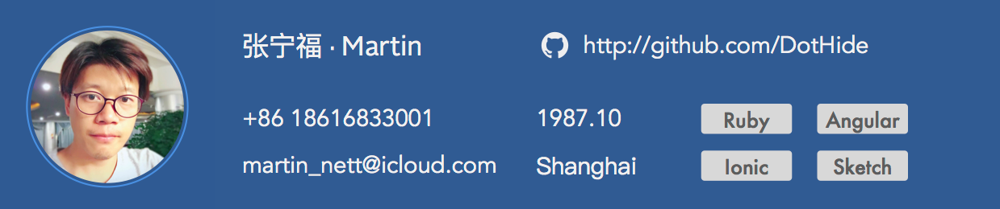

# Education Background
**2013 - 2017**丨SJTU · Master Degree · Software Engineering  
My major is software project management, and get As in almost all courses. Last year I also take part in the practice project called 'CNCrowd' which is a real start-up team.

**2006 - 2010**丨SIT · Bachelor's Degree · Computer Science & Technology  
I've learned C++ Java & SQL in my collage. I built a excellent courses website for our collage. Won the second-class Scholarship for many times. My graduation paper is collage-level excellent paper.
